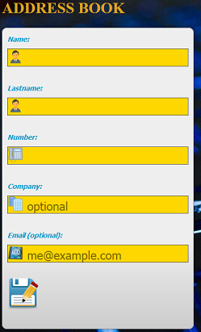
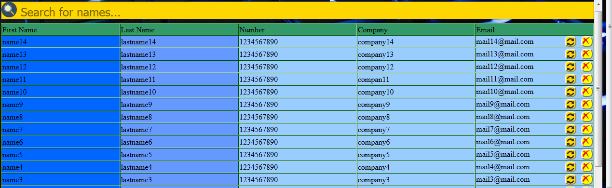
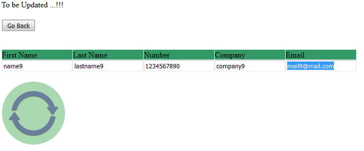

# PHP-Address-Book

## Web based Address book using PHP and MySQL

### Features:
*Add,edit,delete and search records*

**XAMPP was used as the Local Web Server**

*XAMPP stands for Cross-Platform (X), Apache (A), MariaDB (M), PHP (P) and Perl (P).*

### Some important information about the SQL Database###
**MySQL Database name: myform**

**Table name: cform**

**cform Table has 6 columns with Names:**

|  #  | Name       |  Type     |  Extra       |
|-----|------------|-----------|--------------|
|1    |ID          |int(11)    |AUTO_INCREMENT|
|2    |form_name   |text       |              |
|3    |form_lname  |text       |              |
|4    |form_number |varchar(15)|              |
|5    |form_company|text       |              |
|6    |form_email  |text       |              |

*As soon as we complete the form included in the index.php and click on the submit button
the record with the data we provided is created in the database.*

**The form has 3 required fields:**
- Name
- Lastname
- Number

**And 2 optional fields:**
- Company
- Email

**So, an example of how the table in the Database looks is this one :**

| ID | form_name | form_lname | form_number | form_company | form_email       |
|----|-----------|------------|-------------|--------------|------------------|
|1   | name 1    | lastname1  | 1111111111  | company1     | email1@email.com |
|2   | name 2    | lastname2  | 1111111111  | company2     | email2@email.com |
|3   | name 3    | lastname3  | 1111111111  | company3     | email3@email.com |

*Ofcorse we can add as many records as we want.*

**Finally, we can edit and delete any record we want by simply clicking on either the update or Delete icons at the end 
of each record listed inside the HTML Table.**

**Below we see the submit form :**

*As we can see Company and Email are optional, so we can leave these cells empty.*

*After we complete the form, we click on the save button under the form.*

**The HTML table with the records inserted in the Database looks like this :**

*At the end of the HTML table there are two buttons, update and delete.*

*Update lets us update a record in the Database and delete to delete one.*

**Lets say we want to update the record with Firstname:name9, Lastname:Lastname9 etc...**

*We click on the update icon for the above record and we get the following Table :*

| First Name | Last Name | Number   | Company | Email        |
|------------|-----------|----------|---------|--------------|
|name9       | lastname9 |1234567890|company9 |mail9@mail.com|

*Below there is a screenshot of that table :*

*We complete the form with thew new data and click on the update icon. After that the specific record is updated in the
Database with the new values we entered inside the form.*

*Deletion is a lot  simpler. After we click on the delete button the specific record is deleted from the Database and we get back a message with the ID of the record we just deleted.*
